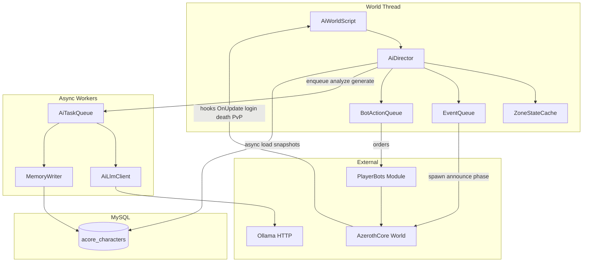
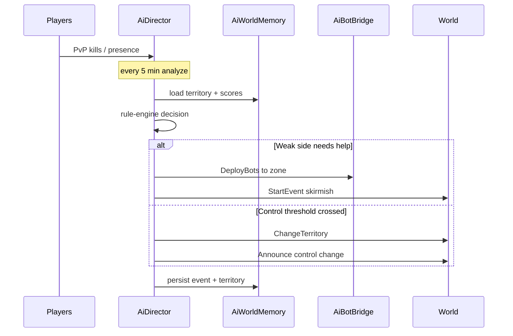

# AI World System — Architecture

Implemented module: `modules/mod-aiworld`.

**Defaults:**
- Placement: `modules/mod-aiworld` (no core patches).
- Prototype zone: Hillsbrad Foothills (`267`).
- LLM: local Ollama over HTTP from a worker thread only.
- PlayerBots: optional; `AiBotBridge` queues strategic orders.

---

## 1. Цели и границы

### Цель
Живой мир: автономные NPC/PlayerBots + стратегический ИИ, управляющий событиями и контролем территорий, без лагов на сервере с **16 GB RAM**.

### Что делает ИИ
- Генерация/выбор сценариев событий
- Диалоги NPC (по запросу, с кэшем)
- Анализ истории мира (периодически)
- Рекомендации Director’у (сценарий, сложность, цели для ботов)

### Что ИИ НЕ делает
- Combat tick / каждый удар / pathfinding / aggro
- Решение каждого действия бота каждый кадр
- Синхронные блокирующие вызовы из `World::Update`

### Принцип слоёв
```
World tick (C++, детерминизм, <1ms budget)
    ↓ собирает метрики / исполняет уже принятые решения
Director tick (каждые N минут, C++)
    ↓ rule-engine + кэш сценариев
LLM worker (async, редкие запросы)
    ↓ только когда rule-engine не хватает / нужна нарративность
MySQL World Memory
```

---

## 2. Высокоуровневая схема



---

## 3. Структура модуля

```
modules/mod-aiworld/
  conf/aiworld.conf.dist
  docs/ARCHITECTURE.md          # этот документ
  docs/API.md                   # контракты Director ↔ bots ↔ LLM
  data/sql/db-characters/base/  # память мира
  data/sql/db-world/base/       # strings, опционально spawns событий
  src/
    aiworld_loader.cpp
    AiWorldCommon.h             # enums, DTO, константы
    AiWorldConfig.h/.cpp        # ConfigValueCache
    AiDirector.h/.cpp           # главный контроллер
    AiZoneAnalyzer.h/.cpp       # метрики зон
    AiEconomyAnalyzer.h/.cpp    # stub в v1, интерфейс готов
    AiFactionScore.h/.cpp       # победы/поражения
    AiEventScheduler.h/.cpp     # очередь/запуск событий
    AiWorldMemory.h/.cpp        # CRUD + кэш поверх MySQL
    AiBotBridge.h/.cpp          # интеграция PlayerBots
    AiLlmClient.h/.cpp          # HTTP Ollama
    AiTaskQueue.h/.cpp          # фоновая очередь
    AiWorldScripts.cpp          # WorldScript / PlayerScript / CommandScript
    prototype/
      HillsbradFront.h/.cpp     # сценарий прототипа
```

Паттерн синглтонов — как [`MakGoraMgr`](modules/mod-makgora/src/MakGoraMgr.h): `sAiDirector`, `sAiWorldMemory`, без хранения сырых `Player*` между тиками (только `ObjectGuid`).

---

## 4. C++ классы и ответственность

### 4.1 `AiDirector` — главный контроллер
- Периодический цикл: `Update(diff)` из `WorldScript::OnUpdate`.
- Каждые `AiWorld.Director.IntervalSec` (default **300**):
  1. Снимок метрик из `AiZoneAnalyzer` / `AiFactionScore`
  2. Rule-engine → кандидат действия (`DirectorAction`)
  3. Если нужен LLM и бюджет позволяет → enqueue в `AiTaskQueue`
  4. Иначе сразу применять детерминированное решение
- Управляет **сложностью мира** (`WorldTension` 0..100): растёт при дисбалансе фракций / низкой активности, падает при долгих стабильных периодах.
- Никогда не ждёт HTTP/LLM на world thread.

### 4.2 `AiZoneAnalyzer`
Вход (из кэша + лёгких хуков, не full map scan каждый тик):
- online players / bots по зоне и по фракции
- PvP kills / deaths за окно
- средний уровень, AFK-доля (если доступно)
- текущий `TerritoryControl`

Выход: `ZoneSnapshot` (POD, копируется в async без указателей на игровые объекты).

### 4.3 `AiFactionScore`
- Накопители побед/поражений (kill, захват, событие).
- Rolling window (например 1ч / 24ч) в памяти + flush в DB.
- Score влияет на `WorldTension` и выбор сценария.

### 4.4 `AiEconomyAnalyzer` (фаза 2+)
- Интерфейс + stub: AH volume / vendor spend по зоне.
- В прототипе не обязателен; Director использует только population + combat + control.

### 4.5 `AiEventScheduler`
- Очередь `WorldEvent` с приоритетом и cooldown per-zone / per-type.
- Исполнение на world thread: announce, spawn wave, phase mask, bot orders.
- Жёсткий лимит: max concurrent events, max bot deployments.

### 4.6 `AiWorldMemory`
- In-memory LRU/TTL кэш поверх MySQL (characters DB).
- Async write path через `CharacterDatabase` + prepared statements.
- API: `RecordEvent`, `SetTerritory`, `RecordPlayerAction`, `GetRecentHistory(zone, limit)`.

### 4.7 `AiBotBridge`
Адаптер к PlayerBots (не замена AI ботов):
- Высокоуровневые приказы: `DeployToZone`, `DefendTerritory`, `JoinEvent`, `AssistPlayer`, `FormGroup`.
- Реализация v1: команды/teleport/quest-flag через публичный API модуля ботов + fallback GM-like login bots, если API недоступен.
- На world tick только dequeue и выдача приказов; боевой AI остаётся у PlayerBots.

### 4.8 `AiLlmClient` + `AiTaskQueue`
- Один worker thread (или пул из 1–2), очередь задач с backpressure.
- Задачи: `AnalyzeHistory`, `ProposeScenario`, `GenerateNpcDialogue`.
- Таймаут, retry, circuit breaker; при недоступности Ollama — silent fallback на rule-engine.
- Ответ парсится в строгий JSON-схемный DTO; мусор → discard.

### 4.9 Scripts
| Script | Роль |
|--------|------|
| `WorldScript` | config load, memory load, `OnUpdate` → Director |
| `PlayerScript` | login/logout, death, zone change → метрики / memory |
| `CommandScript` | `.aiworld status\|analyze\|event\|tension\|memory` |
| `PlayerbotScript` | optional hooks если модуль ботов активен |

---

## 5. Структуры данных (C++)

```cpp
enum class FactionSide : uint8 { Neutral = 0, Alliance = 1, Horde = 2 };
enum class TerritoryState : uint8 { Contested, AllianceHeld, HordeHeld };
enum class DirectorActionType : uint8 {
    None, ChangeTerritory, DeployBots, StartEvent, AdjustTension, Announce
};
enum class AiTaskType : uint8 { AnalyzeHistory, ProposeScenario, GenerateDialogue };

struct ZoneSnapshot {
    uint32 zoneId;
    uint32 alliancePlayers;
    uint32 hordePlayers;
    uint32 allianceBots;
    uint32 hordeBots;
    uint32 pvpKillsAlliance; // window
    uint32 pvpKillsHorde;
    TerritoryState control;
    uint32 tension;          // zone-local
    uint32 unixTime;
};

struct DirectorAction {
    DirectorActionType type;
    uint32 zoneId;
    FactionSide beneficiary;
    uint32 eventTemplateId;
    uint32 botCount;
    uint8 priority;
    std::string reason;      // short, for memory/log
};

struct WorldEvent {
    uint64 id;
    uint32 templateId;
    uint32 zoneId;
    FactionSide aggressor;
    uint32 startUnix;
    uint32 endUnix;
    uint8 state;             // Scheduled/Active/Completed/Cancelled
};

struct BotOrder {
    ObjectGuid botGuid;      // 0 = any matching filter
    uint32 zoneId;
    uint8 orderType;         // Defend/Attack/Assist/Group
    FactionSide side;
    uint32 expireUnix;
};
```

---

## 6. SQL (World Memory) — characters DB

Модуль: `data/sql/db-characters/base/aiworld_characters.sql`.

### `aiworld_territory`
| Column | Type | Notes |
|--------|------|-------|
| zone_id | INT UNSIGNED PK | |
| state | TINYINT | Contested/Alliance/Horde |
| controller | TINYINT | FactionSide |
| control_score | INT | -1000..1000 |
| tension | INT UNSIGNED | 0..100 |
| updated_at | INT UNSIGNED | unix |

### `aiworld_event_history`
| Column | Type | Notes |
|--------|------|-------|
| id | BIGINT AI PK | |
| zone_id | INT UNSIGNED | indexed |
| event_type | VARCHAR(64) | |
| template_id | INT UNSIGNED | |
| aggressor | TINYINT | |
| winner | TINYINT | |
| payload_json | TEXT | compact metrics |
| created_at | INT UNSIGNED | |

### `aiworld_faction_score`
| Column | Type | Notes |
|--------|------|-------|
| side | TINYINT PK | Alliance/Horde |
| window_hour | INT | kills/captures |
| window_day | INT | |
| total | BIGINT | |
| updated_at | INT UNSIGNED | |

### `aiworld_player_action`
| Column | Type | Notes |
|--------|------|-------|
| id | BIGINT AI PK | |
| guid | INT UNSIGNED | character |
| zone_id | INT UNSIGNED | |
| action_type | VARCHAR(32) | kill/capture/assist/… |
| side | TINYINT | |
| created_at | INT UNSIGNED | |
Индекс `(zone_id, created_at)`, retention job (purge > N дней).

### `aiworld_npc_change`
| Column | Type | Notes |
|--------|------|-------|
| id | BIGINT AI PK | |
| zone_id | INT | |
| entry | INT | creature entry |
| change_type | VARCHAR(32) | spawn/despawn/faction/phase |
| details_json | TEXT | |
| created_at | INT UNSIGNED | |

### `aiworld_llm_cache`
| Column | Type | Notes |
|--------|------|-------|
| cache_key | CHAR(64) PK | hash prompt+context |
| response_json | MEDIUMTEXT | |
| created_at | INT UNSIGNED | |
| expires_at | INT UNSIGNED | |

World DB (опционально позже): `acore_string` для анонсов, creature templates для event waves.

---

## 7. API между компонентами

### 7.1 AzerothCore → AI (ingress)
Хуки собирают **события**, не решения:
- zone enter/leave, death (PvP), login/logout
- периодический sampling online counts per watched zone

### 7.2 AI → AzerothCore (egress)
Только через узкий фасад `AiWorldRuntime`:
- `Announce(stringId | text)`
- `SetTerritory(zone, state)` (+ visual: worldstate / gossip flag / phase — прототип: announce + DB + optional GO flag)
- `SpawnEventCreatures(templateId)` / despawn on end
- `QueueBotOrder(BotOrder)`

### 7.3 AI ↔ PlayerBots
```
AiBotBridge::RequestDeploy(side, zone, count, role)
AiBotBridge::RequestDefend(zone, side)
AiBotBridge::RequestAssist(playerGuid)
```
Внутри: вызовы API PlayerBots (login random bots, set strategy, move to position). Если модуль ботов выключен — логируем и пропускаем (Director всё равно меняет territory/event для игроков).

### 7.4 AI ↔ LLM (JSON contract)
Request:
```json
{
  "task": "ProposeScenario",
  "zoneId": 267,
  "snapshot": { "...ZoneSnapshot..." },
  "recentEvents": [ {"type":"territory_flip","winner":"Horde"} ],
  "allowedActions": ["ChangeTerritory","DeployBots","StartEvent","Announce"]
}
```
Response (strict):
```json
{
  "action": "DeployBots",
  "beneficiary": "Alliance",
  "botCount": 5,
  "eventTemplateId": 0,
  "reason": "Alliance outnumbered in Hillsbrad",
  "dialogue": null
}
```
Невалидный JSON / неизвестный action → ignore, use rule-engine.

---

## 8. Производительность (16 GB RAM)

| Механизм | Параметр (conf) | Default |
|----------|-----------------|---------|
| Director interval | `AiWorld.Director.IntervalSec` | 300 |
| Watched zones | whitelist | только Hillsbrad в v1 |
| Metric sampling | `AiWorld.Metrics.SampleSec` | 30 |
| Task queue depth | `AiWorld.Task.MaxQueue` | 32 |
| LLM concurrency | `AiWorld.Llm.MaxConcurrent` | 1 |
| LLM timeout | `AiWorld.Llm.TimeoutMs` | 8000 |
| Memory cache | territory + last 100 events/zone | in RAM |
| Event history retention | `AiWorld.Memory.RetentionDays` | 30 |
| World-tick budget | early-out if queue empty | O(1) |

Правила:
- Никаких full `Map::GetPlayers()` каждую секунду для всех карт — только watched zones.
- DB writes async; reads на старте + редкий refresh.
- LLM ответы кэшируются в `aiworld_llm_cache`.
- Circuit breaker: 3 fail → disable LLM на `CooldownSec`, Director работает на rules.

Оценка RAM: модуль < 50 MB hot state; Ollama — **отдельный процесс** (рекомендуется 3–7B модель, ~4–8 GB; на той же машине оставить запас worldserver ~4–6 GB).

---

## 9. Director rule-engine (прототип без LLM)

Для Hillsbrad каждый цикл:

1. Собрать `ZoneSnapshot`.
2. `imbalance = alliancePower - hordePower` (players*2 + bots + recent kills).
3. Если `|imbalance|` > threshold и cooldown истёк:
   - слабая сторона: `DeployBots` + возможен `StartEvent` (patrol/skirmish)
   - если control_score пересекает порог: `ChangeTerritory`
4. Обновить `tension`, записать `aiworld_event_history`.
5. Если `AiWorld.Llm.Enabled` и tension высокий — опционально запросить `ProposeScenario` (не блокируя); результат применится на **следующем** Director tick.

---

## 10. Первый прототип — сценарий

**Hillsbrad Front**



Минимальный demo path:
1. Включить `AiWorld.Enable = 1`, зона 267.
2. Набрать дисбаланс (или `.aiworld simulate imbalance horde`).
3. Увидеть: боты стороны Альянса, анонс события, смена control в DB, запись history.
4. `.aiworld status` показывает snapshot + last actions.

---

## 11. Конфиг (`aiworld.conf.dist`)

Ключевые ключи:
- `AiWorld.Enable`
- `AiWorld.Director.IntervalSec`
- `AiWorld.Zones` (comma list, default `267`)
- `AiWorld.Bots.Enable` / `AiWorld.Bots.MaxDeploy`
- `AiWorld.Llm.Enable` / `Endpoint` / `Model` / `TimeoutMs`
- `AiWorld.Memory.RetentionDays`
- `AiWorld.Prototype.Hillsbrad.Enable`

---

## 12. Этапы реализации (после утверждения)

| Phase | Deliverable |
|-------|-------------|
| **0** | Каркас модуля + conf + loader + empty Director tick + `.aiworld status` |
| **1** | SQL memory tables + `AiWorldMemory` + territory get/set |
| **2** | Zone metrics + faction score + rule-engine + Hillsbrad control flip + announce |
| **3** | `AiEventScheduler` + одно event template (skirmish announce/spawns) |
| **4** | `AiBotBridge` (если `mod-playerbots` доступен) + deploy/defend orders |
| **5** | `AiTaskQueue` + `AiLlmClient` (Ollama) + cache + fallback |
| **6** | Economy analyzer stub, retention purge, docs/API.md, polish GM commands |

На каждом этапе — только этот scope; без преждевременного LLM до работающего rule-engine.

---

## 13. Явные non-goals v1

- Полный симулятор экономики / auction AI
- Замена SmartAI / CreatureAI на LLM
- Кросс-realm / multi-process Director
- Клиентский аддон (можно позже по образцу MakGora)
- Изменение outdoor PvP ядра (ZM/NA и т.д.) — свой lightweight territory layer

---

## 14. Риски

| Risk | Mitigation |
|------|------------|
| PlayerBots отсутствует в tree | Bridge + feature flag; прототип territory/event без ботов |
| Ollama жрёт RAM | LLM optional; small model; circuit breaker |
| Лаги от сканов зон | whitelist zones + sampling interval |
| Галлюцинации LLM | strict JSON schema + allowlist actions |
